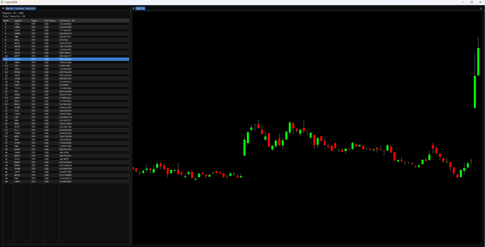

# Charting Software

Real-time stock charting application that connects to the IBKR TWS API, renders charts with OpenGL (GLFW), and uses ImGui for the UI.



---

## Prerequisites

- [Visual Studio 2022](https://visualstudio.microsoft.com/) with the **Desktop development with C++** workload
  - Make sure **CMake tools for Windows** and **Ninja** are checked during install
- [vcpkg](https://github.com/microsoft/vcpkg) installed and bootstrapped
- Interactive Brokers **TWS** or **IB Gateway** running locally

---

## 1. Clone the Repository

```bash
git clone https://github.com/anhddo/chart_glfw.git
cd cpp45k
```

---

## 2. Install vcpkg Dependencies

All dependencies are declared in `vcpkg.json`. Run the following from your vcpkg directory:

```bash
cd <your-vcpkg-root>
./vcpkg install
```

Or let CMake/vcpkg manifest mode install them automatically on first configure.

---

## 3. Create Your CMakeUserPresets.json

`CMakeUserPresets.json` is gitignored and must be created manually. It tells CMake where your vcpkg is installed.

Create a file named `CMakeUserPresets.json` in the repo root with the following content, replacing the path with your actual vcpkg location:

```json
{
  "version": 3,
  "configurePresets": [
    {
      "name": "user-default",
      "inherits": "default",
      "environment": {
        "VCPKG_ROOT": "C:/path/to/your/vcpkg"
      }
    }
  ]
}
```

---

## 4. Open and Configure in Visual Studio

1. Open Visual Studio 2022
2. Choose **Open a local folder** and select the repo root
3. Visual Studio will detect `CMakePresets.json` automatically
4. In the configuration dropdown (top toolbar), select **user-default**
5. Visual Studio will run CMake configure — watch the **Output** window for any errors

---

## 5. Set Up config.json

The app reads connection settings from `chart_glfw/config.json`. This file is gitignored. Copy the template and fill in your details:

```bash
cp cpp45k/config.json.template cpp45k/config.json
```

Edit `config.json`:

```json
{
  "ibkr": {
    "account": "YOUR_ACCOUNT_NUMBER",
    "host": "127.0.0.1",
    "port": 7497,
    "clientId": 0
  },
  "scanner": {
    "defaultScanCode": "TOP_PERC_GAIN",
    "priceAbove": 5.0
  }
}
```

> **Port reference:** `7497` = TWS paper trading, `7495` = IB Gateway paper, `7496` = TWS live

---

## 6. Build and Run

1. In Visual Studio, select **Build → Build All** (`Ctrl+Shift+B`)
2. Set `chart_glfw` as the startup item (**right-click → Set as Startup Item**)
3. Press **F5** to run

Make sure TWS or IB Gateway is running and **API connections are enabled** before launching.

---

## Dependencies

| Library | Source |
|---|---|
| [GLFW](https://www.glfw.org/) | `third_party/glfw` |
| [ImGui](https://github.com/ocornut/imgui) | `third_party/imgui` |
| [GLAD](https://glad.dav1d.de/) | `third_party/glad` |
| [IBKR TWS API](https://interactivebrokers.github.io/) | `third_party/ibkr_api` |
| [GLM](https://github.com/g-truc/glm) | vcpkg |
| [nlohmann/json](https://github.com/nlohmann/json) | vcpkg |
| [protobuf](https://github.com/protocolbuffers/protobuf) | vcpkg |